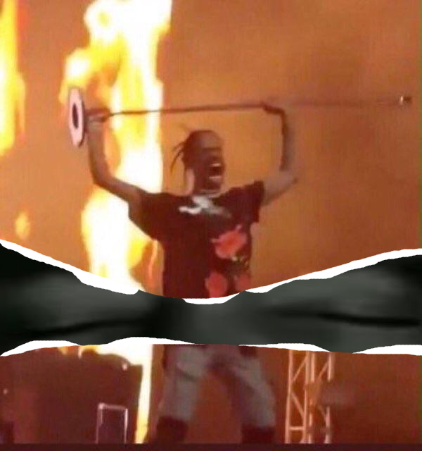
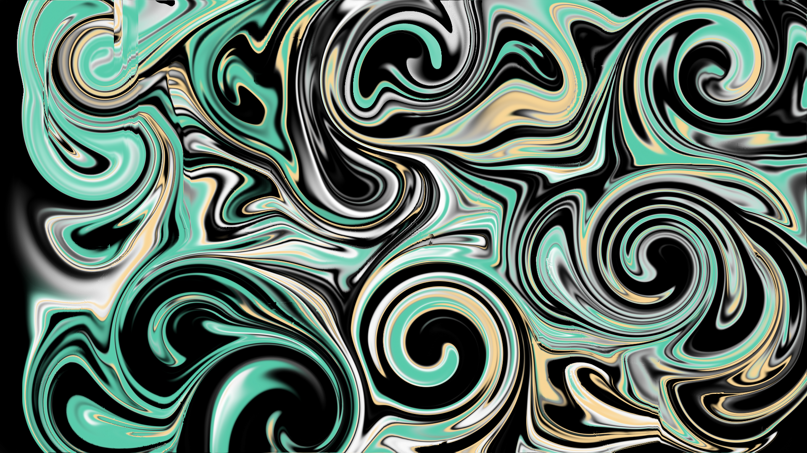
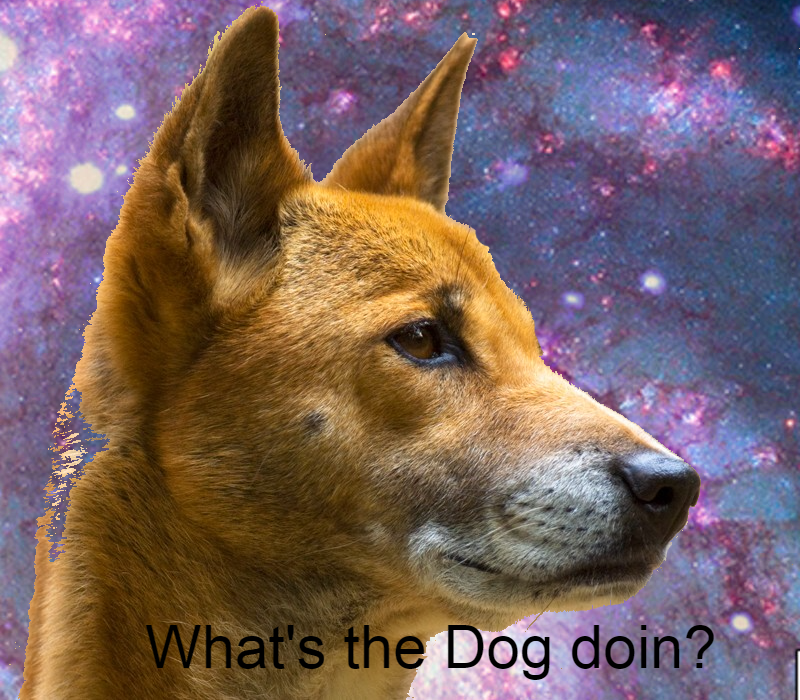

## Andres' Portfolio

--- 
Edited Photos

[Double Exposure Effect](/sample_page)

---
[Ripped Effect Portrait](/pdf/sample_presentation.pdf)

---
[Grafitti style image](http://example.com/)

---
[Galaxy Dog](http://example.com/)

---
[Earth Day](http://example.com/)

---
[Cool Retro Collage](http://example.com/)

---
[3D Pop Out Effect](http://example.com/)

### Category Name 2

- [Double Exposure Effect](http://example.com/)
- [Ripped Effect Portrait](http://example.com/)
- [Grafitti style image](http://example.com/)
- [Galaxy Dog](http://example.com/)
- [Earth Day](http://example.com/)
- [Cool Retro Collage](http://example.com/)
- [3D Pop Out Effect](http://example.com/)

---

---

Page template forked from <a href="https://github.com/evanca/quick-portfolio">evanca</a>

<!-- Remove above link if you don't want to attibute -->
